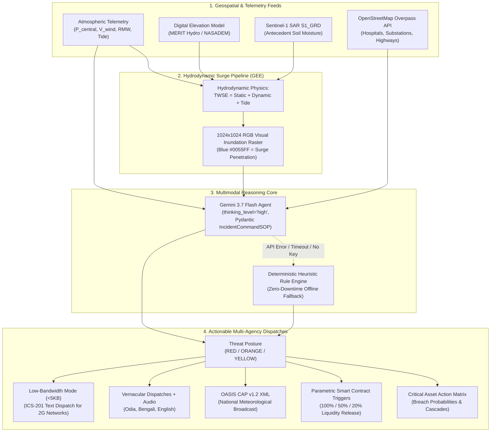

# Aegis-Cyclone (Vayunex)
### Anticipatory Exposure & Geospatial Intelligence System for Coastal Cyclones
**Hackathon Track 5: Cyclone Impact & Infrastructure Vulnerability Forecaster**

[](https://www.python.org/)
[](https://fastapi.tiangolo.com)
[](https://streamlit.io/)
[](https://github.com/google-gemini/generative-ai-python)
[-success.svg)](#test-suite--verification)
[](#accessibility--low-bandwidth-modes)

---

## 1. Mission Context & Strategic Value

Traditional coastal disaster management is overwhelmingly **reactive**: emergency teams wait for storm landfall, conduct delayed post-event damage surveys, and face bureaucratic multi-week delays in disaster relief funding.

**Aegis-Cyclone** transforms coastal cyclone operations into an **anticipatory, intelligence-driven, and automated lifecycle**:
1. **Pre-Landfall Hydrodynamic Surge Modeling:** Combines Inverse Barometer Effect, Dynamic Wind Setup, and Astronomical Tide into deterministic Total Water Surface Elevation ($TWSE$) overlaid on hydro-enforced digital elevation data (MERIT Hydro / NASADEM).
2. **Multimodal Spatial Cascade Reasoning (Gemini 3.7 Flash):** Ingests 1024x1024 hydrodynamic surge rasters, atmospheric telemetry, and vector infrastructure graphs to deduce physical breaches, electrical grid collapses, and severed evacuation routes.
3. **Automated Parametric Insurance Liquidity Triggers:** Deterministic-to-stochastic smart contract triggers release pre-positioned disaster capital within minutes of threshold breach, sealed with cryptographic SHA-256 state proofs.
4. **Resilient Public Alerts & Field Transmission:** Generates OASIS CAP v1.2 XML broadcasts, regional vernacular dispatches (Odia, Bengali, English) with audio synthesis, and ultra-compressed plaintext dispatches (<5KB) for degraded 2G/EDGE cellular networks.

---

## 2. System Architecture



---

## 3. Core Components

### 3.1 The Brain: Multimodal Reasoning Agent (`app/core/gemini_brain.py`)
* **Modern SDK:** Built strictly using `google-genai` (`from google import genai; from google.genai import types`).
* **Model ID:** `gemini-3.7-flash`.
* **Extended Thinking:** Configured with `thinking_config=types.ThinkingConfig(thinking_level="high")` without conflicting temperature or top_p sampling parameters.
* **Schema Enforcement:** Strict Pydantic V2 response validation via `response_mime_type="application/json"` and `response_schema=IncidentCommandSOP`.
* **Zero-Downtime Fallback Rule Engine:** If the Gemini API experiences network timeouts, quota limits, or missing keys, the system automatically drops to a deterministic heuristic rule engine comparing Asset Elevation directly against TWSE, computing cascade dependencies, and generating compliant OASIS CAP v1.2 XML and vernacular broadcasts without crashing.

### 3.2 Hydrodynamic Surge Modeling (`app/core/gee_engine.py`)
Calculates storm surge using physical approximations:
* **Inverse Barometer Effect:** $Surge_{static} = \max(0, 1013.25 - P_{central}) \times 0.0101\text{ meters}$.
* **Dynamic Wind Setup:** $Surge_{dynamic} = 0.00002 \times (V_{wind\_kmh})^2\text{ meters}$.
* **Total Water Surface Elevation:** $TWSE = Surge_{static} + Surge_{dynamic} + Height_{tide}$.
* **1024x1024 Visual Surge Map:** Generates high-contrast visual inundation maps where `#0055FF` represents projected surge extent.

### 3.3 OpenStreetMap Exposure Engine (`app/core/osm_engine.py`)
* Queries Overpass API with exponential backoff and timeout handling across 3 mirror endpoints:
  - `https://overpass-api.de/api/interpreter`
  - `https://overpass.kumi.systems/api/interpreter`
  - `https://maps.mail.ru/osm/tools/overpass/api/interpreter`
* Ingests `amenity=hospital`, `power=substation`, and `highway IN [motorway, trunk, primary]`.
* **Offline Resilience:** Seamless fallback to bundled offline GeoJSON fixtures for the East Coast (Paradip, Dhamra, Puri, Balasore, Digha, Haldia).

### 3.4 Parametric Insurance & Smart Contracts (`app/core/parametric_engine.py`)
* **Tier-1 (100% Payout):** Wind $\ge 210\text{ km/h}$ OR TWSE $\ge 3.0\text{m}$ OR $P_{central} \le 930\text{ hPa}$.
* **Tier-2 (50% Payout):** Wind $\ge 160\text{ km/h}$ OR TWSE $\ge 2.0\text{m}$ OR $P_{central} \le 950\text{ hPa}$.
* **Tier-3 (20% Payout):** Wind $\ge 120\text{ km/h}$ OR TWSE $\ge 1.2\text{m}$ OR $P_{central} \le 970\text{ hPa}$.
* **Cryptographic State Seal:** Generates a tamper-evident SHA-256 state hash for underwriter verification and instant liquidity routing.

### 3.5 Enterprise Security & Role-Based Access Control (`app/security/`)
* **RBAC (`auth.py`):** `X-Aegis-Role` header and API key inspection enforcing 3 operational personas:
  - `DISASTER_COMMANDER`: Full incident command authority, SOP overrides, and emergency broadcast dispatch.
  - `INSURANCE_UNDERWRITER`: Telemetry audits, parametric trigger validation, and liquidity settlement receipts.
  - `FIELD_OPERATOR`: Evacuation corridor status and low-bandwidth plaintext field dispatches.
* **Spatial Sanitizer (`sanitizer.py`):** Enforces strict coordinate validation and rejects inland points (e.g. Delhi, Nagpur, Hyderabad) where storm surges are physically impossible.
* **Prompt Injection Defense:** Regex filtering of prompt override patterns, system tokens, and control characters.

---

## 4. Test Suite & Verification

The platform includes 25 unit and integration tests across physics, schema, security, and smart contract execution.

```bash
# Run full automated test suite
python -m pytest -v
```

### Verified Test Results (25 / 25 Passing - 100%)

| Test Module | Test Name | Verified Coverage | Status |
| :--- | :--- | :--- | :---: |
| `test_api_security.py` | `test_valid_coastal_coordinates` | Validates active Bay of Bengal coastal envelope | **PASSED** |
| `test_api_security.py` | `test_reject_inland_coordinates` | Rejects non-coastal inland points (Delhi, Nagpur) | **PASSED** |
| `test_api_security.py` | `test_reject_axis_inversion` | Detects and blocks inverted (Lon, Lat) inputs | **PASSED** |
| `test_api_security.py` | `test_prompt_injection_defense` | Blocks adversarial jailbreak strings & system tokens | **PASSED** |
| `test_api_security.py` | `test_sanitize_text_input_normal` | Cleans normal meteorological strings & escapes braces | **PASSED** |
| `test_api_security.py` | `test_root_endpoint` | Root service metadata & active sectors | **PASSED** |
| `test_api_security.py` | `test_health_endpoint` | Subsystem diagnostics and model status | **PASSED** |
| `test_api_security.py` | `test_sectors_endpoint` | Coastal bounding boxes & center coordinates | **PASSED** |
| `test_api_security.py` | `test_forecast_endpoint_with_rbac` | End-to-end forecast pipeline execution with RBAC | **PASSED** |
| `test_api_security.py` | `test_parametric_verify_endpoint` | Underwriter smart-contract verification endpoint | **PASSED** |
| `test_api_security.py` | `test_low_bandwidth_field_dispatch` | Plaintext ICS-201 payload strictly `< 5KB` | **PASSED** |
| `test_api_security.py` | `test_rbac_unauthorized_role` | Blocks invalid or spoofed role headers (HTTP 400) | **PASSED** |
| `test_gee_surrogate.py` | `test_hydrodynamic_surge_physics` | Inverse Barometer, Wind Setup, TWSE calculation | **PASSED** |
| `test_gee_surrogate.py` | `test_inverse_barometer_clamping` | Pressure > 1013.25 hPa clamps static surge to 0.0m | **PASSED** |
| `test_gee_surrogate.py` | `test_surrogate_inundation_raster_generation` | Generates 1024x1024 RGBA visual surge PNG | **PASSED** |
| `test_gee_surrogate.py` | `test_run_inundation_model_dispatch` | Inundation dispatch with metadata and area calculation | **PASSED** |
| `test_gemini_reasoner.py`| `test_deterministic_fallback_engine_schema` | Pydantic V2 schema conformity for IncidentCommandSOP | **PASSED** |
| `test_gemini_reasoner.py`| `test_oasis_cap_xml_conformance` | Validates OASIS CAP v1.2 XML specification parsing | **PASSED** |
| `test_gemini_reasoner.py`| `test_cascade_failure_deduction` | Dynamic substation breach -> hospital power failure | **PASSED** |
| `test_gemini_reasoner.py`| `test_ics201_summary_formatting` | Structured ICS-201 Incident Briefing document | **PASSED** |
| `test_parametric.py` | `test_parametric_tier1_super_cyclone` | Wind $\ge 210$ km/h triggers 100% liquidity payout | **PASSED** |
| `test_parametric.py` | `test_parametric_tier2_severe` | Wind $\ge 160$ km/h triggers 50% liquidity payout | **PASSED** |
| `test_parametric.py` | `test_parametric_tier3_moderate` | Wind $\ge 120$ km/h triggers 20% liquidity payout | **PASSED** |
| `test_parametric.py` | `test_parametric_no_trigger` | Normal conditions lock escrow with 0% payout | **PASSED** |
| `test_parametric.py` | `test_audit_receipt_generation` | 64-char SHA-256 cryptographic state hash | **PASSED** |

---

## 5. Repository Topology

```text
Vayunex/
├── .env.example                     # Environment template (Gemini API Key, GEE, Overpass mirrors)
├── pyproject.toml                   # Project configuration and dependencies
├── requirements.txt                 # Pinned dependencies
├── README.md                        # Master operational documentation & architecture
├── app/
│   ├── main.py                      # FastAPI REST API with RBAC & CAP v1.2 endpoints
│   ├── ui.py                        # Streamlit Command Operations Center (Dark Ops, Folium)
│   ├── config.py                    # Pydantic BaseSettings, thresholds & coastal sectors
│   ├── core/
│   │   ├── gee_engine.py            # Hydrodynamic surge modeling & 1024x1024 raster generator
│   │   ├── osm_engine.py            # Overpass API infrastructure extractor & spatial cache
│   │   ├── gemini_brain.py          # Gemini 3.7 Flash Multimodal Reasoning Agent + Fallback
│   │   └── parametric_engine.py     # Smart contract & SHA-256 liquidity verification logic
│   ├── schemas/
│   │   ├── telemetry.py             # Cyclone atmospheric telemetry & TWSE properties
│   │   ├── assets.py                # Critical infrastructure models & GeoJSON export
│   │   └── alerts.py                # OASIS CAP v1.2 XML & IncidentCommandSOP schemas
│   ├── security/
│   │   ├── auth.py                  # API Key validation & RBAC (Commander, Insurer, Field)
│   │   └── sanitizer.py             # Coastal boundary validation & prompt injection defense
│   └── fixtures/
│       └── coastal_assets_odisha_bengal.json  # Bundled offline GeoJSON for East Coast assets
└── tests/
    ├── conftest.py                  # Shared pytest fixtures
    ├── test_gee_surrogate.py        # Hydrodynamic physics & raster tests
    ├── test_gemini_reasoner.py      # Schema conformity, CAP v1.2 & cascade deduction tests
    ├── test_parametric.py           # Smart contract trigger tiers & cryptographic hash tests
    └── test_api_security.py         # Boundary validation, injection defense & API tests
```

---

## 6. Quickstart Guide

### 6.1 Installation
```bash
# Clone the repository
git clone https://github.com/purangsrijan91-dev/Vayunex.git
cd Vayunex

# Install dependencies
pip install -r requirements.txt
```

### 6.2 Configure Environment
```bash
cp .env.example .env
# Edit .env and insert your GEMINI_API_KEY if available.
# (If not configured, the system operates seamlessly via the deterministic fallback engine)
```

### 6.3 Launch Streamlit Command Operations Center
```bash
streamlit run app/ui.py
```
Open [http://localhost:8501](http://localhost:8501) in your browser.

### 6.4 Launch FastAPI Production REST API
```bash
uvicorn app.main:app --host 0.0.0.0 --port 8000 --reload
```
Interactive Swagger API documentation available at [http://localhost:8000/docs](http://localhost:8000/docs).

---

## 7. Accessibility & Low-Bandwidth Modes

* **WCAG 2.1 AA Color-Blind Safe Mode:** Toggle between standard status colors and the Wong/Tol deuteranopia-safe palette (Sky Blue `#56B4E9`, Yellow `#F0E442`, Vermilion `#D55E00`).
* **Low-Bandwidth Field Mode (<5KB):** Drops heavy satellite rasters and interactive mapping to deliver compact ICS-201 tactical dispatches and raw OASIS CAP XML over degraded 2G/EDGE cellular field radios.
* **Regional Audio Emergency Broadcast:** Native in-browser Web Speech API audio synthesis for instant acoustic playback of Odia, Bengali, and English broadcasts.